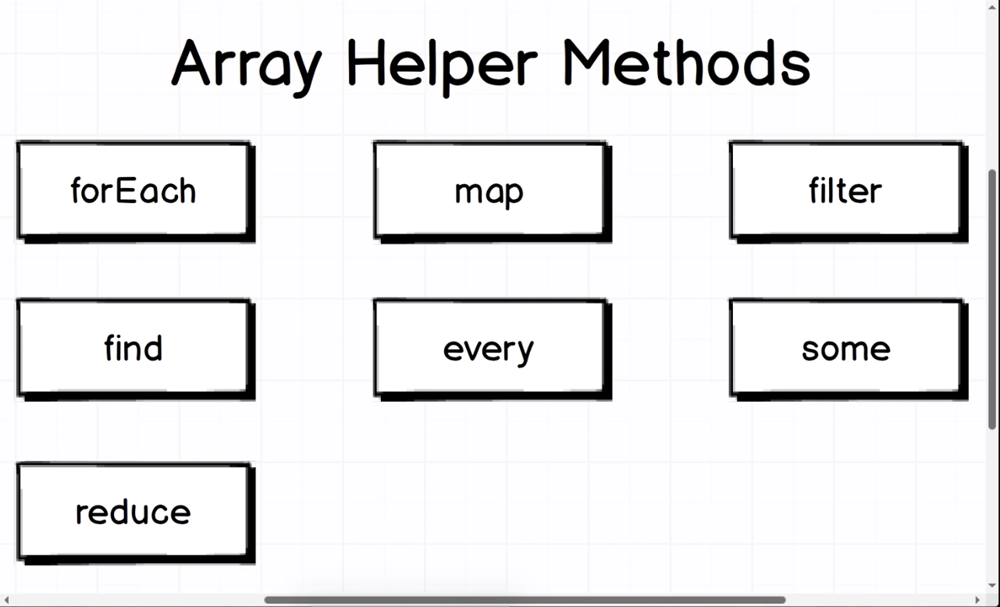
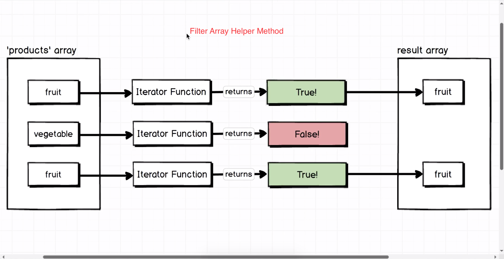
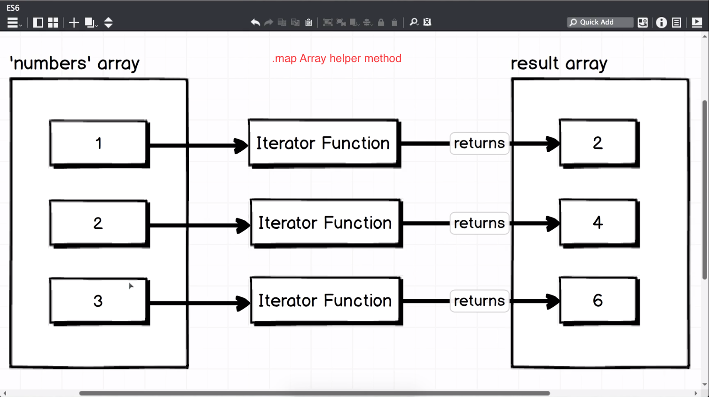
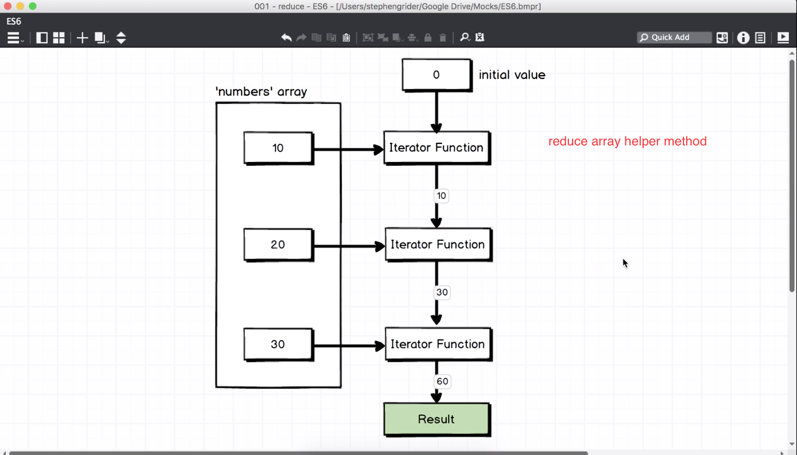
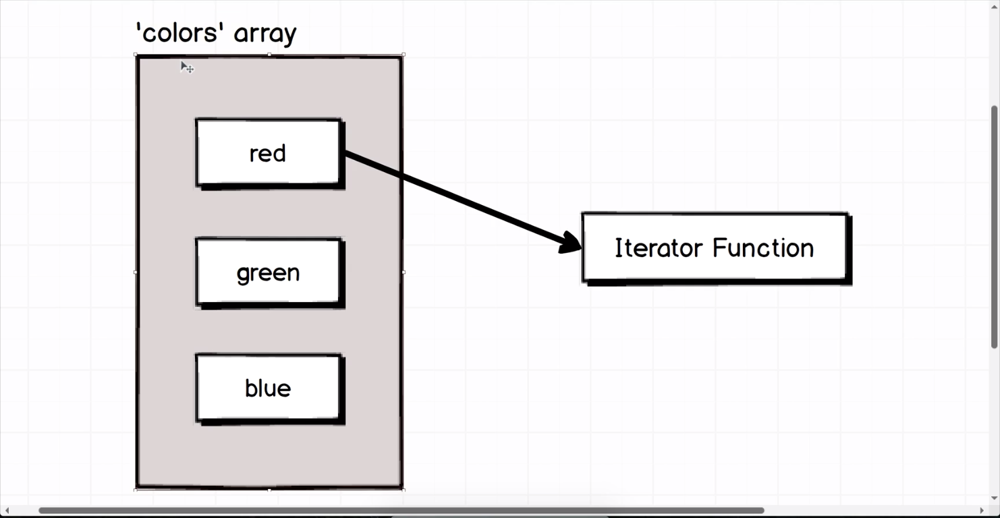
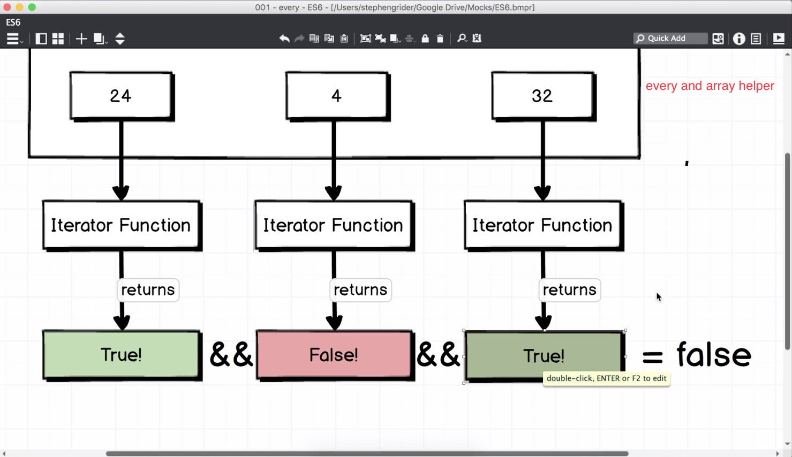

# JavaScript Array and Object Methods

* All the methods in this article are chain-able, meaning they can be used in combination with one another and they also don’t mutate data, which is especially important when working with React. With all these array and object methods you’ll find you never have to reach for a for or while loop ever again.

## .filter()

* Creates a new array based on whether the items of an array pass a certain condition.

### Example

* Create an array of student ages that meet the legal drinking age.
---
    const studentsAge = [17, 16, 18, 19, 21, 17];
    const ableToDrink = studentsAge.filter( age => age > 18 );

    // ableToDrink will be equal to [19, 21]
## .map()

* Creates a new array by manipulating the values in another array. Great for data manipulation and it is often used in React because it is an immutable method.

### Example

* Create an array that adds a $ to the beginning of each number.
---
    const numbers = [2, 3, 4, 5];
    const dollars = numbers.map( number => '$' + number);

    // dollars will be equal to ['$2', '$3', '$4', '$5']

### How to convert a string of numbers into an array of numbers

http://www.wirfs-brock.com/allen/posts/166

https://developer.mozilla.org/en-US/docs/Web/JavaScript/Reference/Global_Objects/Array/map

    const stringNums = '12345';
    let newArray;

    newArrayNums = stringNums.split('').map(function(item) {
    // we split the nums array and add commas in between with ('')
        return parseInt(item, 10); // parseInt takes two args.

    // first arg is an expression, second is a radix (10 based on decimal system because it uses digits 1 through 9)
        https://en.wikipedia.org/wiki/Radix
    });

    console.log(newArrayNums); // [ 1, 2, 3, 4, 5 ]
---

    // Arrow function version

    newArrayNums = stringNums.split('').map (item => parseInt(item, 10));

    newArrayNums; // [ 1, 2, 3, 4, 5 ]

## .reduce()

* This often overlooked method uses an accumulator to reduce all items in an array to a single value. Great for calculating totals. The returned value can be of any type (i.e. object, array, string, integer).

### Example

* Add up the integers in an array.
---
    const numbers = [5, 10, 15];
    const total = numbers.reduce( (accumulator, currentValue) => accumulator + currentValue);

    // total will be equal to 30

* There are some really cool use cases for .reduce() outlined in the MDN docs that provide examples on how to do things likes flattening an array of arrays, grouping objects by a property, and removing duplicate items in array.

### Example 2

* *reduce* helper is one of the most flexible of all the array helpers
---
    var numbers = [ 10, 20 , 30 ];

    var sum = 0; // we make a sum variable and start it out at 0

    for (var i = 0; i < numbers.length; i++) {
    sum += numbers[i]; // we have a sum and we add on numbers at [i].
    }
    sum;
---
    // using reduce method

    numbers.reduce(function(sum, number){ // we pass in sum and number as arguments to the function
    return sum + number;

    }, 0); // 60 // in reduce, we pass in an initial value (0). The initial value will take the place of the second argument
     --to reduce (after our function)

    // So the first time the iterator function runs it's going to execute and we return a value of 10 because
    0 plus 10 is 10.

    // The iterator function returns 10 and that's represented by this line right here( see diagram ).

    This 10 gets piped into the next run of the iterator function as the first argument and then 20 comes in as the second argument.

    So putting this into practice practicality some would now be 10.

    And number would be 20.

    The iterator function would then return 30 and then for the very last through run through the iterator

    the value from the previous iteration comes in is 30 as the first argument.

    And the second argument is 30 out of the array.

    And so 30 plus 30 is 60.

* So in summary the really weird thing about Reduce is that we'd pass in an initial value and then this initial value is sent to our iterator function for every single run through it.

* The main advantage of array helper methods like reduce is they are condensing down our array to a single value

* The initial value that we're starting off with zero we can have any arbitrary initial value that
we want so we can have zero right here.

* We could have a 1000 or 100 or a -30 or 3000 or whatever it might be.

* Any initial value that we want whatsoever we can pass in here.

* We decide what the initial value is based on what we're trying to do with this reduce function.

## .forEach()

* Applies a function on each item in an array.

### Example

* Log each array item to the console
---
    const emotions = ['happy', 'sad', 'angry'];
    emotions.forEach( emotion => console.log(emotion) );

    // Will log the following:
    // 'happy'
    // 'sad'
    // 'angry'

## .some()

* Checks if any item in an array passes the condition. A good use case would be checking for user privileges. It can also be used similarly to a .forEach() where you would perform an action on each array item and break out of the loop once a truthy value is returned.

### Example

* Check if there is at least one 'admin' in an array.
---
    const userPrivileges = ['user', 'user', 'user', 'admin'];
    const containsAdmin = userPrivileges.some( element => element === 'admin');

    // containsAdmin will be equal to true

## .every()

* Similar to .some(), but checks if all items in an array pass a condition.

### Example

* Check if all ratings are equal to or greater than 3 stars.
---
    const ratings = [3, 5, 4, 3, 5];
    const goodOverallRating = ratings.every( rating => rating >= 3 );

    // goodOverallRating will be equal to true

### .includes()

* Checks if an array contains a certain value. It’s similar to .some(),but instead of looking for a condition to pass, it looks if the array contains a specific value.

### Example

* Check if the array includes an item with the string ‘waldo’.
---

    const names = ['sophie', 'george', 'waldo', 'stephen', 'henry'];
    const includesWaldo = names.includes('waldo');

    // includesWaldo will be equal to true

## The for...in loop

* The for...in loop improves upon the weaknesses of the for loop by eliminating the counting logic and exit condition.
---
      const digits = [0, 1, 2, 3, 4, 5, 6, 7, 8, 9];

      for (const index in digits) {
      console.log(digits[index]);
      }

* But, you still have to deal with the issue of using an index to access the values of the array, and that stinks; it almost makes it more confusing than before.

* Also, the for...in loop can get you into big trouble when you need to add an extra method to an array (or another object). Because for...in loops loop over all enumerable properties, this means if you add any additional properties to the array's prototype, then those properties will also appear in the loop.
---
      Array.prototype.decimalfy = function() {
        for (let i = 0; i < this.length; i++) {
          this[i] = this[i].toFixed(2);
          }
      };
---
    const digits = [0, 1, 2, 3, 4, 5, 6, 7, 8, 9];

    for (const index in digits) {
    console.log(digits[index]);
    }
      //1 2 3 4 5 6 7 8 9
      function() {
      for (let i = 0; i < this.length; i++)
      this[i] = this[i].toFixed(2);

* This is why for...in loops are discouraged when looping over arrays.

**NOTE:** The forEach loop is another type of for loop in JavaScript. However, forEach() is actually an array method, so it can only be used exclusively with arrays. There is also no way to stop or break a forEach loop. If you need that type of behavior in your loop, you’ll have to use a basic for loop.

## For...of loop
* The for...of loop is used to loop over **any** type of data that is iterable.

* You write a for...of loop almost exactly like you would write a for...in loop, except you swap out in with of and you can drop the index.
---
      const digits = [0, 1, 2, 3, 4, 5, 6, 7, 8, 9];

      for (const digit of digits) {
      console.log(digit);
      }

* This makes the for...of loop the most concise version of all the for loops.

**TIP:** It’s good practice to use plural names for objects that are collections of values. That way, when you loop over the collection, you can use the singular version of the name when referencing individual values in the collection. For example,

    for (const button of buttons) {...}.

* The for...of loop also has some additional benefits that fix the weaknesses of the for and for...in loops.

* You can stop or break a for...of loop at anytime.
---
    const digits = [0, 1, 2, 3, 4, 5, 6, 7, 8, 9];

    for (const digit of digits) {
    if (digit % 2 === 0) {
    continue;
    }
    console.log(digit);
    }

    // Prints: 1 3 5 7 9

* And you don’t have to worry about adding new properties to objects. The for...of loop will only loop over the values in the object.
---
    Array.prototype.decimalfy = function() {
      for (i = 0; i < this.length; i++) {
      this[i] = this[i].toFixed(2);
      }
    };
---
    const digits = [0, 1, 2, 3, 4, 5, 6, 7, 8, 9];

      for (const digit of digits) {
      console.log(digit);
      }
    // Prints: 0 1 2 3 4 5 6 7 8 9

### Example
**Write a for...of loop that:
loops through each day in the days array,
capitalizes the first letter of the day
and prints the day out to the console.
Your code should log the following to the console:**

    Sunday Monday Tuesday Wednesday Thursday Friday Saturday
---
**Your Code:**

    const days = ['sunday', 'monday', 'tuesday', 'wednesday', 'thursday', 'friday', 'saturday'];

      for (const day of days) {
      // console.log(day.charAt(0).toUpperCase() + day.slice(1).toLowerCase());
      console.log(`${day.charAt(0).toUpperCase()}${day.slice(1)}`); // using object literal
    }

    // Sunday Monday Tuesday Wednesday Thursday Friday Saturday

## Array.from()

* This is a static method that creates an array based on another array or string. You can also pass a map callback function as an argument to further shape the data in the new array. Honestly, I’m not too sure why someone would use this over the .map() method.

### Example

* Create an array from a string.

        const newArray = Array.from('hello');

        // newArray will be equal to ['h', 'e', 'l', 'l', 'o']

* Create an array that has double the value for each item in another array.

        const doubledValues = Array.from([2, 4, 6], number => number * 2);

        // doubleValues will be equal to [4, 8, 12]

## Object.values()

* Return an array of the values of an object.

### Example

    const icecreamColors = {
    chocolate: 'brown',
    vanilla: 'white',
    strawberry: 'red',
    }

    const colors = Object.values(icecreamColors);

    // colors will be equal to ["brown", "white", "red"]

## Object.keys()

* Return an array of the keys of an object.

### Example

    const icecreamColors = {
    chocolate: 'brown',
    vanilla: 'white',
    strawberry: 'red',
    }

    const types = Object.keys(icecreamColors);

    // types will be equal to ["chocolate", "vanilla", "strawberry"]

## Object.entries()

* Creates an array which contains arrays of key/value pairs of an object.

### Example

    const weather = {
    rain: 0,
    temperature: 24,
    humidity: 33,
    }

    const entries = Object.entries(weather);

    // entries will be equal to
    // [['rain', 0], ['temperature', 24], ['humidity', 33]]

## Array spread

* Spreading arrays using the spread operator (…) allows you to expand the elements in an array. It’s useful when concatenating a bunch of arrays together. It’s also a good way to avoid using the splice() method when looking to remove certain elements from an array because it can be combined with the slice() method to prevent direct mutation of an array.

### Example

* Combine two arrays.

        const spreadableOne = [1, 2, 3, 4];
        const spreadableTwo = [5, 6, 7, 8];

        const combined = [...spreadableOne, ...spreadableTwo];

        // combined will be equal to [1, 2, 3, 4, 5, 6, 7, 8]

* Remove an array element without mutating the original array.

        const animals = ['squirrel', 'bear', 'deer', 'salmon', 'rat'];
        const mammals = [...animals.slice(0,3), ...animals.slice(4)];

        // mammals will be equal to ['squirrel', 'bear', 'deer', 'rat']

## Object spread
Spreading an object allows for the addition of new properties and values to an object without mutations (i.e. a new object is created) and it can also be used to combine multiple objects together. It should be noted that spreading objects does not do nested copying.

### Example

* Add a new object property and value without mutating the original object.

        const spreadableObject = {
        name: 'Robert',
        phone: 'iPhone'
        };

        const newObject = {
        ...spreadableObject,
        carModel: 'Volkswagen'
        }

        // newObject will be equal to
        // { carModel: 'Volkswagen', name: 'Robert', phone: 'iPhone' }

## Function Rest

* Functions can use the rest parameter syntax to accept any number of arguments as an array.

### Example

* Display the array of passed arguments.

        function displayArgumentsArray(...theArguments) {
        console.log(theArguments);
        }

        displayArgumentsArray('hi', 'there', 'bud');

        // Will print ['hi', 'there', 'bud']

## Object.freeze()

* Prevents you from modifying existing object properties or adding new properties and values to an object. It’s often what people think const does, however const allows you to modify an object.

### Example

* Freeze an object to prevent the name property from being changed.

        const frozenObject = {
        name: 'Robert'
        }

## Object.freeze(frozenObject);

        frozenObject.name = 'Henry';

        // frozenObject will be equal to { name: 'Robert' }

## Object.seal()

* Stops any new properties from being added to an object, but still allows for existing properties to be changed.

### Example

* Seal an object to prevent the wearsWatch property from being added.

        const sealedObject = {
        name: 'Robert'
        }

## Object.seal(sealedObject);

        sealedObject.name = 'Bob';
        sealedObject.wearsWatch = true;

        // sealedObject will be equal to { name: 'Bob' }

## Object.assign()

* Allows for objects to be combined together. This method is not really needed because you can use the object spread syntax instead. Like the object spread operator, Object.assign() does not do deep cloning. Lodash is your best friend when it comes to deep cloning objects.

### Example

* Combine two objects into one.

        const firstObject = {
        firstName: 'Robert'
        }

        const secondObject = {
        lastName: 'Cooper'
        }

        const combinedObject = Object.assign(firstObject, secondObject);

        // combinedObject will be equal to { firstName: 'Robert', lastName: 'Cooper' }
