# Tricky JavaScript Questions

## Explain event delegation:

- JavaScript listeners fire not only on a single DOM element but on all of its descendants(children)
- Example in a `<nav>` if you have an event listener on the nav it will affect all the children like `<ul> -> <li>...`.process is called event bubbling

### Event bubbling:

- The inverse of events bubbling down such as in event delegation. Event bubbling also known as propagation, events on an element will “bubble up” and also fire on all parents.
- When you are clicking

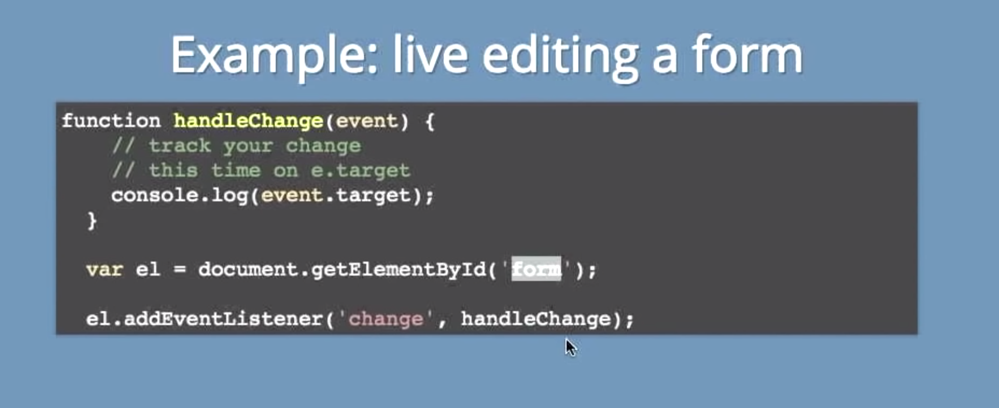

- Grabbing or binding to the parent is going to fire a change event. Grab the parent <form> and everything within it that can fire a change event will fire a change event.
- Event bubbling is delegation. Registering on a parent doesn't "also register on the children". You can test that by adding a child to a parent after you've added an event listener to the parent - it still works. Every event (that is registered in the default event bubbling phase) gets given to the target element first (or to the first ancestor that has a handler registered) then automatically continues to run up the chain of parents until `event.stopPropagation` is called. [MDN Event Bubbling docs](https://developer.mozilla.org/en-US/docs/Learn/JavaScript/Building_blocks/Events#Event_bubbling_and_capture)

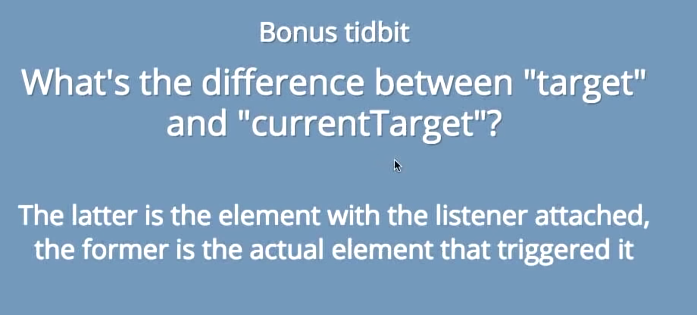

- Target is the actual thing that is clicked while, currentTarget is what you’ve attached the event listener to.
-

### IIFE

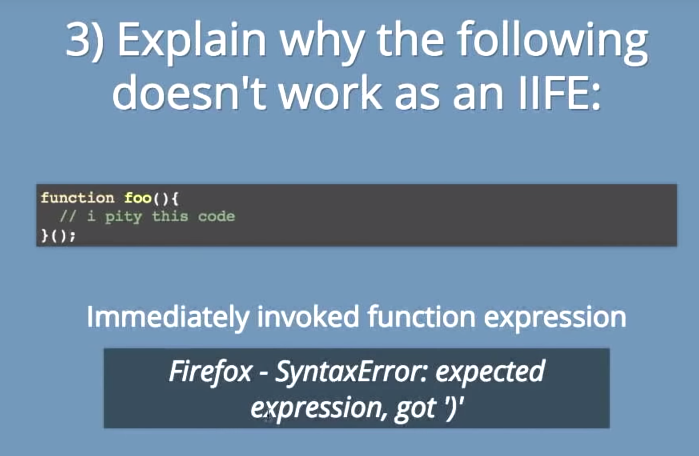

- **Immediately Invoked Function Expression (IIFE)** means to write the function and run it immediately. But you can’t do it in this example.

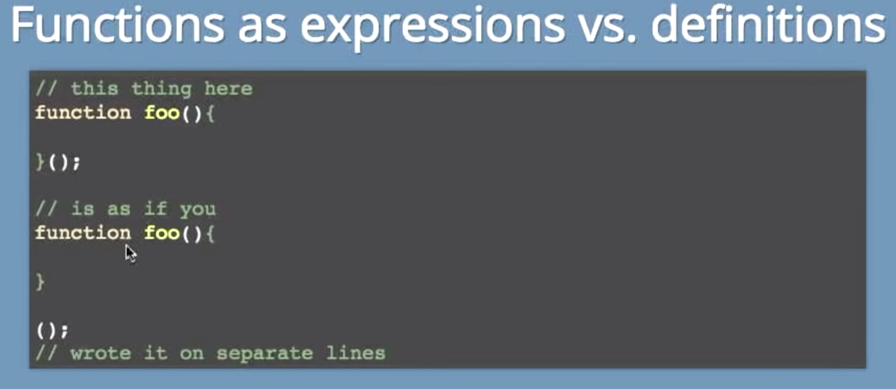

- **Function Expression** result in a value
- **Pure Functions** are served more as references. It is not an actual value so you can’t just run it. It runs but isn’t calling anything.

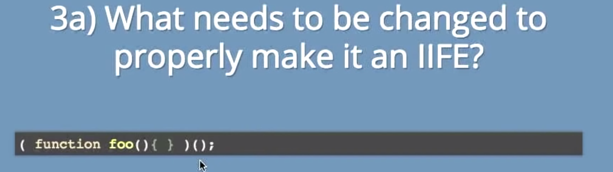

- You can make the function an expression simply by putting parentheses `()` around it.
- Now that the function is in parentheses, JavaScript is going to interpret the function as a **function expression** and not a function statement and can be invoked immediately.
- You would use an **IFFE** to control the variable scope. If it were to run, the variables within the **IIFE** would not be available outside of the function --> **(data security) / encapsulation**.

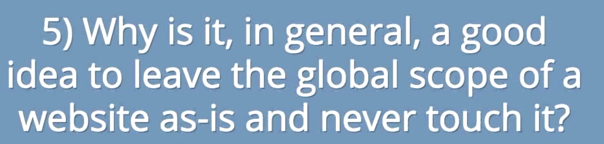

- Self contained
- Maintains independence
- Control your variable names which reduces collisions within your scope

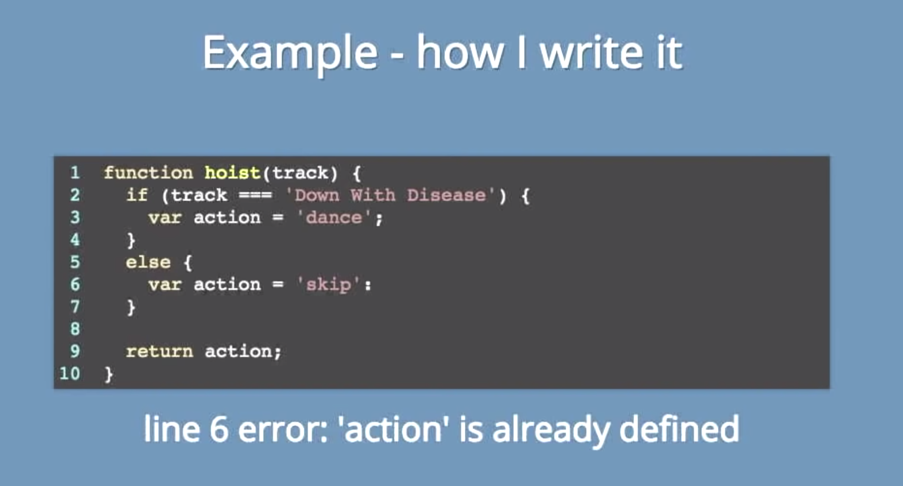

- this is what's really happening
- the action variable is being hoisted to the top it is also being declared a second time which result in an error
- Also if you write functions as statements, those functions are being hoisted to the top just like variables.
- It all boils down to if you write them as statements or assign them to variables.

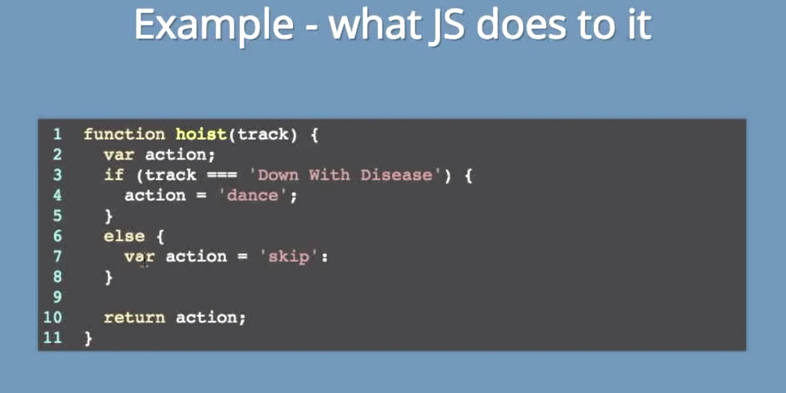

### Const / Let

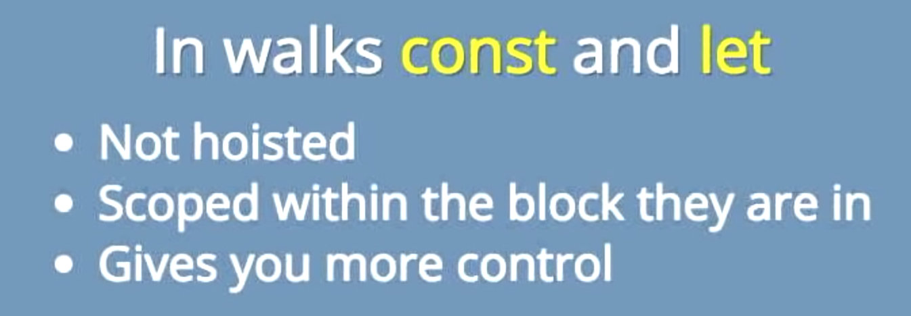

### Null, Undefined, Undeclared

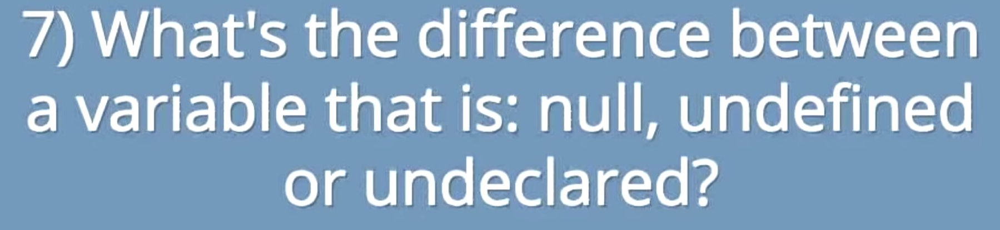

- **Undeclared** is using a variable that has never been declared.
- **Null** is trying to use a variable that has a value of null or a nothing value, a placeholder assignment.
- **Undefined** has been declared but has not been assigned a value.

### Equality `==` vs `===`

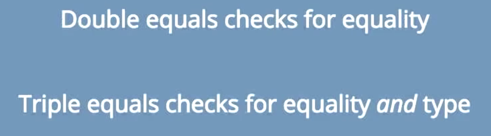
